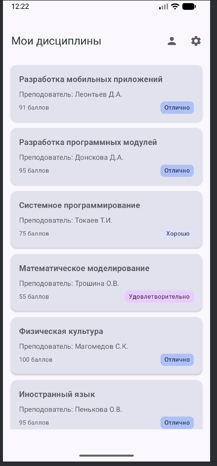
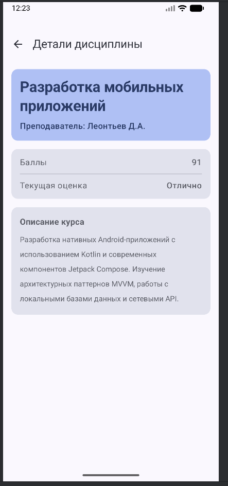
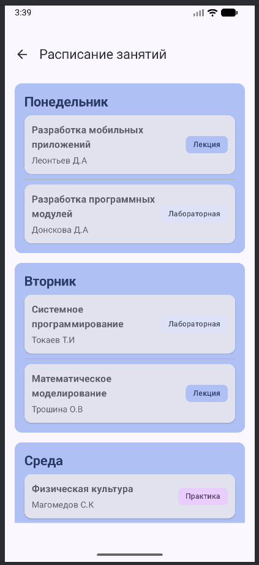
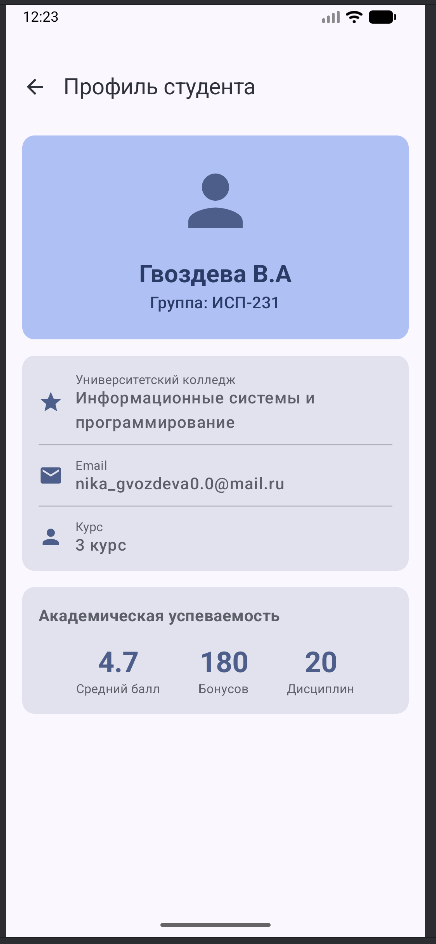
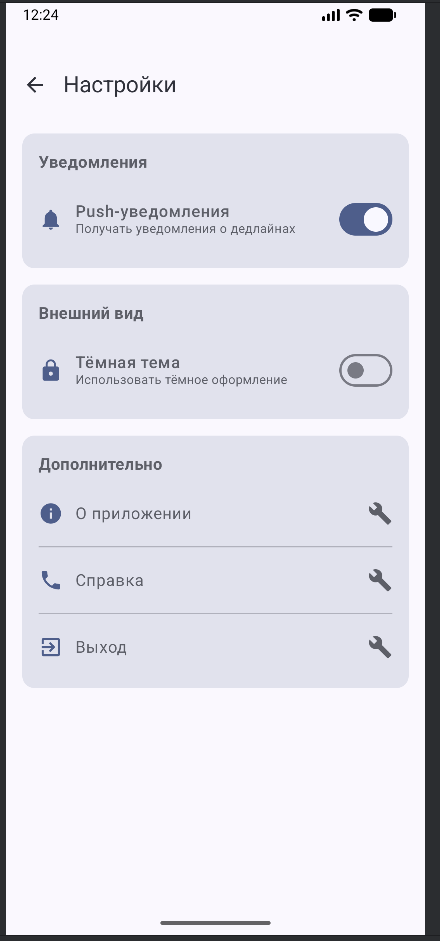

# Лабораторная работа №15-16. Navigation in Jetpack Compose

---

# Student Planner

Приложение предназначено для отслеживания учебных дисциплин, их успеваемости и получения детаьной информации о курсах. Оно помогает студентам структурировать информацию о предметах, накопленных баллах и текущих оценках.

---

## Список реализованных экранов

- **Home (Главный)**: Список всех дисциплин в виде карточек.
- **Details (Детали)**: Подробная информация о выбранной дисциплине.
- **Schedule (Расписание)**: Расписание занятий на неделю с группировкой по дням.
- **LessonDetails (Детали занятия)**: Подробная информация о выбранном занятии.
- **Profile (Профиль)**: Информация о студенте.
- **Settings (Настройки)**: Экран с переключателями уведомлений и темы, а также пунктами "О приложении" и "Выход".

---

## Используемые технологии

- **Kotlin** - язык программирования.
- **Jetpack Compose** - современный UI для построения интерфейса.
- **Navigation Compose** - библиотека для управления навигацией между экранами.

---

## Схема навигации между экранами

### Основная навигация:

- `HomeScreen` -> (Клик по карточке) -> `DetailsScreen`
- `HomeScreen` -> (Кнопка "Расписание") -> `ScheduleScreen`
- `HomeScreen` -> (Кнопка "Профиль") -> `ProfileScreen`
- `HomeScreen` -> (Кнопка "Настройки") -> `SettingsScreen`

### Навигация с экрана расписания:

- `ScheduleScreen` -> (Клик по карточке занятия) -> `LeassonDetailsScreen`

### Возврат напредыдущий экран:

- С любого дочернего экрана -> (Кнопка "Назад") -> `HomeScreen`

---

## Скриншоты основных экранов 

---

## Контрольные вопросы

1. Что такое NavController и для чего он используется?
    - Это "диспетчер" навигации. Он управляет стеком экранов, умеет перемещать пользователя на новый экран, возвращать на предыдущий.
    - В Jetpack Compose UI перерисовывается часто. `rember` сохраняет состояние `NavController` между перерисовками, чтобы контроллер не создавался заново при каждом обновлении интерфейса, инача навигация сбросилась бы.

2. Как передать параметр в маршрут навигации?
    - **Процесс:**
      1. **Определение:** В маршруте экрана указывается `"details/{subjectId}"`.
      2. **Передача:** При вызове `navigate` подставляется значение: `navController.navigate("details/1")`.
      3. **Извлечение:** В `NavHost` при регистрации экрана используется `backStackEntry.arguments?.getString("subjectId")`
    - **Разница**: Обязательные параметры являются частью пути. Если их нет, навигация не сработает. Опциональные параметры передаются через query-строку и имеют значения по умолчанию, их можно не передавать.

3. Зачем использовать sealed class для маршрутов?
    - **Преимущества:** Компилятор проверяет, что вы передаете только существующие маршруты, а не случайные строки. Это удобно для автодополнения кода.
    - **Пример ошибки:** Без `sealed class` можно случайно написать `navController.navigate("hom")` (опечатка) и приложение упадет во время выполнения. С `sealed class` компилятор сразу подсветит ошибку, так как `Screen.Home` не имеет маршрута `"hom"`.

4. Что такое Back Stack и как им управлять?
    - **Схема для Home -> Profile - Settings:**
        `[Home]` -> `[Home, Profile]` -> `[Home, Profile, Settings]`
    - **Что произойдет при** `popBackStack()` на **Settings:** Экран `Settings` будет удален из стека. Текущим станет `Profile`. Стек: `[Home, Profile]`.

5. Как работает startDestination в NavHost?
    - Это стартовый экран. При запуске приложения `NavController` смотрит на этот параметр и отображает соответствующий экран (пример `Screen.Home`).
    - **Можно ли изменить динамически:** Можно. Например, если пользователь не авторизован, можно программно изменить `startDestination` на экран логина, используя условную логику в `NavHost`.
   
6. Что произойдёт, если навигировать на несуществующий маршрут?
    - Приложение упадет, так как `NavController` не найдет соответствующий маршрут в `NavGraph`.
    - **Обработка:** Нужно использовать безопасную навигацию или оборачивать вызов в `try-catch`. Самый надежный способ - использование `seales clss`, который исключает создание несуществующего маршрута на уровне кода.
   
7. Зачем нужен параметр launchSingleTop в навигации?
    - **Проблема без него:** Если пользователь быстро нажмет на кнопку перехода на один и тот же экран дважды, `NavController` создаст в стеке два одинаковых экрана подряд.
    - **Влияние:** `launchSingleTop` проверяет, находится ли целевой экран уже на вершине стека. Если да, он не создает новый экземпляр, а просто показывает текущий.